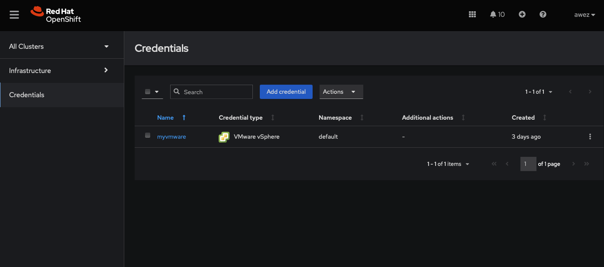

 
# Red Hat Openshift IPI installation on Azure using ACM

This document describes installing Red Hat openshift IPI installation on Microsoft Azure cloud using Red Hat Adavanced cluster Management.

## Prerequisites : 

Detailed prerequisites can be found [here](https://docs.openshift.com/container-platform/4.12/installing/installing_azure/installing-azure-default.html#prerequisites)

To summarize we need the following :

1. Azure account with minimum of the following requirements:
   
    - 44 cpu limits 
    -  7 disks 
    -  1 Vnet 
    -  7 NICs 
    -  2 network security groups 
    -  3 LB's 
    -  3 Public IP's 
    -  7 Private IP's
  
2. DNS Zone in Azure 
3. Proper Azure roles.More info [here](https://docs.openshift.com/container-platform/4.12/installing/installing_azure/installing-azure-account.html#installation-azure-permissions_installing-azure-account)
4. Azure service principal
5. Openshift pull secret
6. ACM ( Hub cluster )

## Installation 

### Adding Azure credentials in ACM

1. On OCP home page click on 
   
   local-cluster -> All clusters

   

2. Credentials -> Add credential
 
    

3. Microsoft Azure
   
   

4. Fill in the following details

   

    Note that Base DNS domain refers to the DNS zone created on Azure.For example as can be seen below on azure portal

    

5. Fill in the below details

    

6. Leave the Proxy blank and click next

    

7. Enter the pull secret that you can obtain from [here](https://console.redhat.com/openshift/install/pull-secret) and SSH keys that will be injected in the OCP nodes

    

8. Finally review the credentials and add

    
    

Note that adding the credentials is a one time process and you can install multiple clusters using the same credentials as long as the required resource limits are met on Azure.

### Creating the cluster

1. Infrastructure -> Clusters -> Create cluster -> Microsoft Azure

    
    

2. Fill in the details 

    

    

    

    

    

    

3. Finally review and create

    

4. Wait for the cluster to be created

    

5. Check activity in Azure portal , Home -> Resource_name -> Activity Log

    

It will take around three hrs based on regions etc and finally you can access the console 